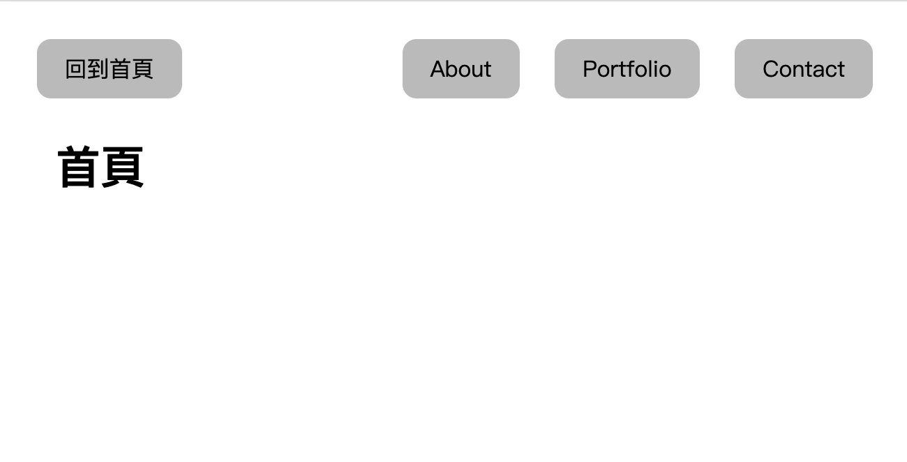

# Express Homework
A simple express related project.

## Project setup
- Install node.js
- Install npm
- Clone the repository to your local computer
- Open up the repository and type the following code in the terminal: 
```
npm install
```
- Once installed, go ahead and type:
```
npm run dev
```
- If you see the following sentence, it means that it is running smoothly. Open the browser and enter the following URL
```
Express listening on http://localhost:3000
```
- If you want to exit from the Node console, type the following code:
```
ctrl + c
```